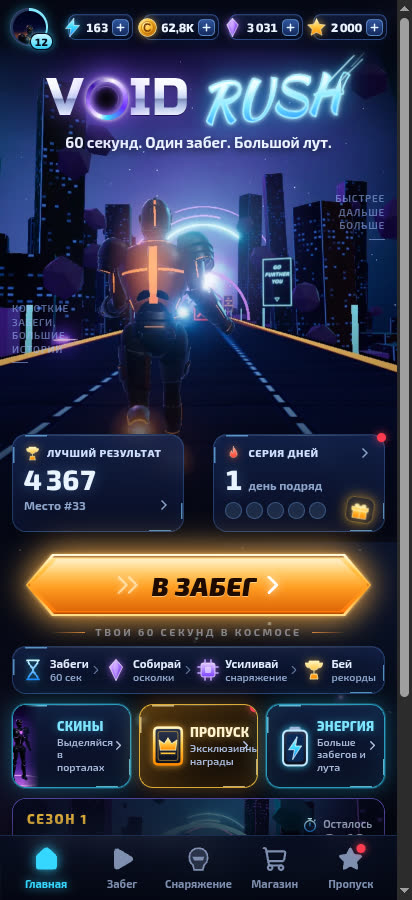
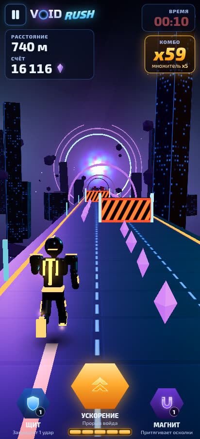
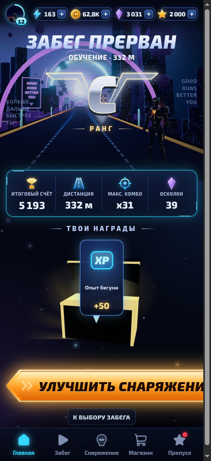
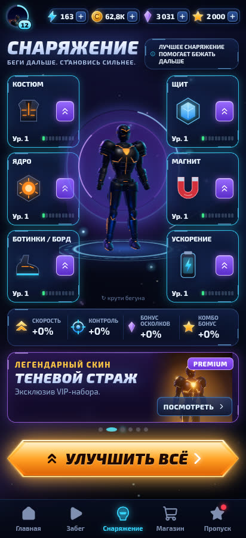
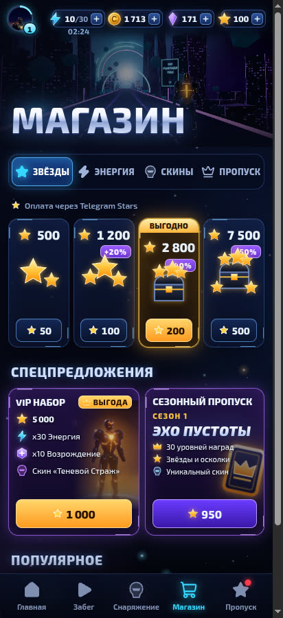
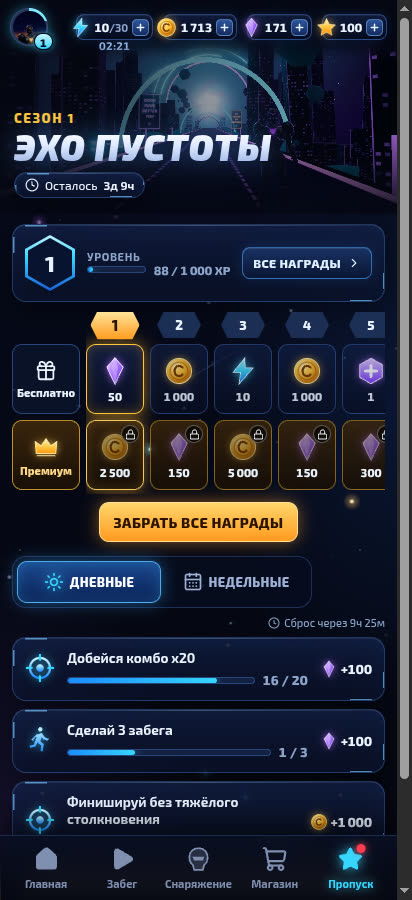
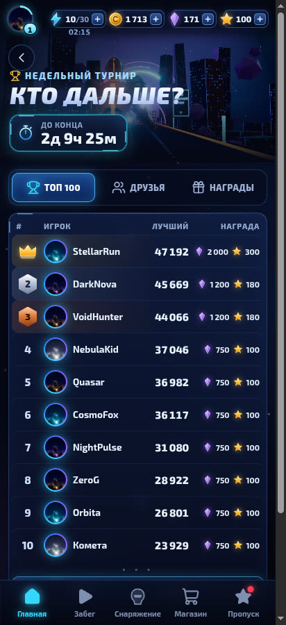

# VOID RUSH

A Telegram Mini App: a **60-second 3D lane runner** with lightweight meta progression (gear, skins, Season Pass, missions, weekly tournament, community boss event). It's built from the *VOID RUSH — Master GameDev Development Specification* and the reference screens.

| Home | Run | Results | Gear |
| --- | --- | --- | --- |
|  |  |  |  |

| Shop | Season Pass | Weekly tournament |
| --- | --- | --- |
|  |  |  |

## Architecture

```
packages/shared   Deterministic game core used by BOTH client and server
  config.ts       Versioned Remote Config defaults (routes, speed curves, scoring, gear, shop, season, event…)
  chunks.ts       Hand-authored route chunks (beats in seconds → consistent reaction windows)
  generator.ts    Seeded route stream + safe-path DP (validates chunks, lays the shard trail)
  sim.ts          Fixed-step (60 Hz) run simulation: lanes, collisions, pickups, combo, gadgets,
                  Ultimate, checkpoints, revive, finish, score — and `replayRun` for the server
  progression.ts  Rewards, XP, energy regen, missions, season/event calendars
apps/server       Node 24 + Fastify + built-in node:sqlite (atomic transactions)
apps/client       React + Zustand UI, Three.js for the live run and the Gear viewer only
```

Key design points:

- **Server-authoritative runs.** `POST /api/runs/start` spends energy and issues `runId`, `seed`, config version and a signed token. The client records only its inputs (`[tick, action]`). On finish, the server **replays the whole run** with the same seed, config version and gear snapshot. Leaderboards and rewards use the replayed summary. Forged tokens, impossible input rates, abnormal timing, unpaid revives (desync) and duplicate submissions are rejected or left unranked.
- **Survivable generation.** Every chunk placement is checked by a lane-path DP, and a lookahead bot test plays sampled seeds on every route (base and max gear) without gadgets.
- **Economy.** Balances, energy timestamps, gear, skins, pass progress, missions, leaderboard settlement and purchases all live on the server. Mutations run in SQLite transactions. Purchases are idempotent per client key, and provider callbacks are deduplicated by `telegram_payment_charge_id`.
- **Rendering split** (spec §5). Menus are 2D DOM. Menu art is pre-rendered from the game's own 3D scene (see *Art studio*). Three.js is lazy-loaded for the run and the Gear/skin viewer. The engine uses pooled obstacle views, instanced pickups, a fixed particle pool, shaders compiled at run start, and automatic quality downgrade.
- **Audio.** WebAudio music (menu and run, which intensifies in the last 15 s) and all SFX are synthesized procedurally, so there are no audio downloads.

## Running locally

Requires Node ≥ 22.18. Node 24 is recommended: the server runs TypeScript directly with native type stripping.

```bash
npm install
npm run dev          # API on :8787 + Vite client on :5173 (proxying /api)
```

Open http://localhost:5173. Without a bot token the server accepts **dev guest logins** and **sandbox payments**; the purchase sheet labels these clearly as test payments. Both are always disabled when `NODE_ENV=production`.

```bash
npm test                 # shared core + server API tests (node:test)
npm run typecheck        # tsc for shared, server and client
npm run build            # production client build → apps/client/dist
npm run survival -- 50   # wide survivability + score calibration sweep
```

A GitHub Actions workflow that runs typecheck, tests and build is at `docs/ci-workflow.yml`. Move it to `.github/workflows/ci.yml` to enable it.

## Configuration

See `.env.example`. The most important variables are:

| Variable | Purpose |
| --- | --- |
| `BOT_TOKEN` | Enables Telegram `initData` auth and Telegram Stars invoices |
| `SESSION_SECRET` | HMAC secret for session and run tokens (**required in production**) |
| `WEBHOOK_SECRET` | Checked against `X-Telegram-Bot-Api-Secret-Token` on `/api/telegram/webhook` |
| `PUBLIC_URL` | Mini App URL used in the bot's `/start` button |
| `BOT_USERNAME`, `APP_SHORT_NAME` | Build `t.me/<bot>/<app>?startapp=ref_…` invite links (Friends tab) |
| `DATA_DIR` / `DB_FILE` | SQLite location |
| `REMOTE_CONFIG_FILE` | JSON deep-merged over the defaults and hot-reloaded. Bump `version` whenever tuning changes, because each run replays against the version it started with |
| `SEED_DEMO` | Demo rivals for leaderboard/event on empty databases (default on outside production) |

## Deploying to Telegram

1. `npm ci && npm run build`, then `NODE_ENV=production SESSION_SECRET=… BOT_TOKEN=… npm start`. A single Node process serves both the API and `apps/client/dist`. Put it behind HTTPS.
2. In @BotFather, create the bot, create a Mini App pointing at your HTTPS URL (`/newapp`), and enable payments in Telegram Stars (no provider token is needed for XTR).
3. Register the webhook: `https://api.telegram.org/bot<TOKEN>/setWebhook?url=https://<host>/api/telegram/webhook&secret_token=<WEBHOOK_SECRET>`. The webhook answers `pre_checkout_query` only for pending orders with a matching amount, and grants `successful_payment` exactly once.

## Art studio

Menu illustrations in `apps/client/public/art` are rendered from the real game scene (World, Runner, obstacles), not drawn by hand. To regenerate them, run `npm run dev` and open `http://localhost:5173/art.html` (or `?only=skin` for a subset) in a WebGL-capable browser. On a GPU-less machine, `scripts/headless-gl.sh` starts Chrome with SwiftShader.

## Spec coverage and known gaps

Implemented:

- **Run:** three lanes with swipe buffering, speed curves, 8 obstacle families (blocker, dual-lane gate, telegraphed laser, moving mine, broken platform, falling debris, pulse wall, void spike), soft/hard collisions and near misses, shards/credits/boost charges/event cores, combo with a ×5 multiplier cap, checkpoint boosts (6 types), Shield/Magnet gadgets, the Void Break Ultimate, one server-paid revive, finish portal, grades C–S+.
- **Routes:** Neon Tunnel, Void Rift, Broken Bridge, Secret Route (unlock rules), Event route with a distant boss, and a scripted tutorial.
- **Meta:** player level, 6 gear slots (upgrade and "Upgrade all" with confirmation), 7 skins with preview/compare/equip, shop (Stars packs, VIP, energy, revive, credits, skins, pass), 30-level Season Pass with free and premium tracks, daily/weekly missions, login streak, weekly Top-100/Friends leaderboard with settled reward tiers, community boss event with milestones, analytics events, settings (music, SFX, haptics, reduced shake/flash, graphics tier), and loading/error/maintenance/version-mismatch states.

Not yet done or not verified:

- Real Telegram Stars payments and `initData` login were not exercised end to end, because that needs a bot token. The code paths are unit-tested with signed fixtures and the sandbox provider.
- The *Rotating Barrier* obstacle family is not implemented (8 of the ~8–12 recommended families are).
- Friends are players connected through referral links; Telegram doesn't expose contact lists to Mini Apps.
- Visual checks ran in headless Chrome with software WebGL. On-device frame-rate tuning is still needed.